# identity-generator

Web-app hosted here --> https://bbrockmann1.github.io/identity-generator/

https://docs.google.com/document/d/1lzLmyOzEkCWJcaHmlMR3x6KwNYLTuO9--lgrkfj7fsc/edit

Functionality:

The Generate Users Button:

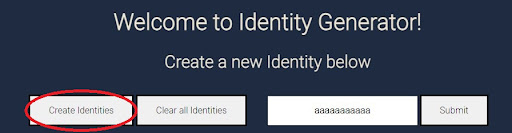

This button is hooked up to the click event listener, and when it is clicked, we fetch information from our api 4 times in a Promise.all so that they all appear on the page simultaneously. 

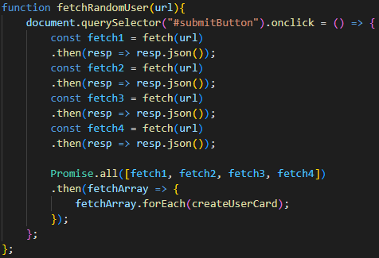

This is our code black that runs this, and for the information that we receive from our api, we then run it through our createUserCard function.

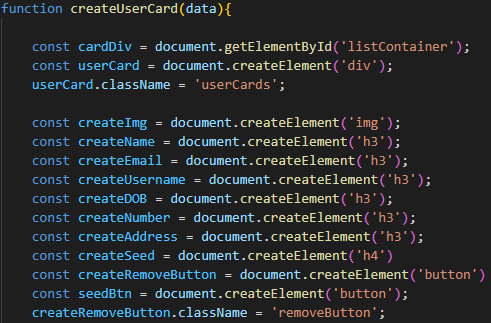

The first part of this function creates the HTML elements that we want for every piece of information from our api. The information includes a random image, name, email, username, date of birth, number, address, a seed (that I will go into later), and a remove seed button styled to look like an X at the top right. We also create a container div that we want everything to be in. We used CSS to style our userCards so that each div looks like its own individual card on the page. 

This section of code is what updates the text content of the elements we created. We used interpolation and input some data we received from our api.

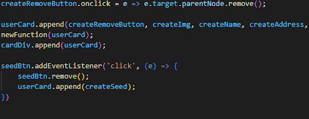

The final section of this function gives functionality to our remove button deleting its parent node, aka the userCard div it is attached to. It also appends everything to the div we create and then appends our div to the HTML element user card container that we have hard coded in. The seed button is just put there to cover our seed until they click on it, and that seed information is dealt with in a later function. 

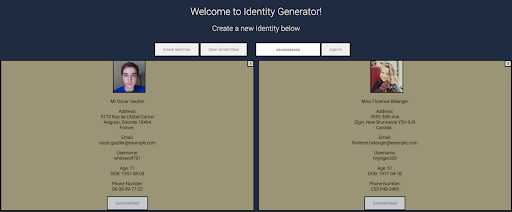

(Sample Cards Created)

The Edit Button

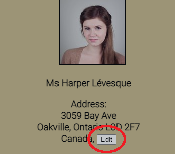

We created an edit button so that when a user card is created, if you hover your mouse over one of the pieces of information, you can edit it. 

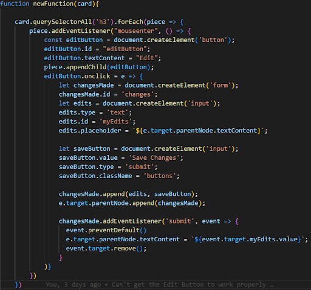

This is the section of the function that pops up our edit button when you hover, but also we defined what would happen when you click it here as well. We made it so that a form is created that we can enter text into and submit that would update that specific html element's text content with whatever value we submitted. 

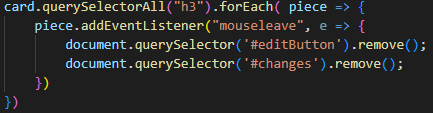

Here is where we handle the event of when you stop hovering, we have it delete the edit button as well as the form if you did happen to click the edit button but stop hovering over that html element, or any of its children nodes, like the edit button. 

Clear All Users Button

This button allows us to delete all of the user cards we have created thus far.

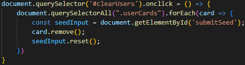

This code essentially just takes all of our user cards (selecting them through their class) and removing them.

Enter Seed Form

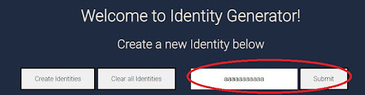

So, we receive a seed in our api to link us back to a specific random user, so by entering that seed into our form, you are able to display a past random user. 

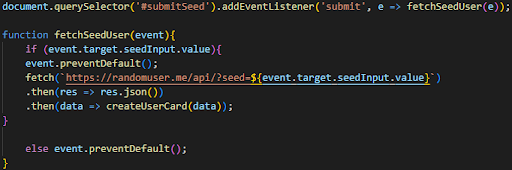

This block deals with that, here, we target that form, and then we pass through our function fetchSeedUser as what should occur. We essentially just run a fetch, and then pass that information back through our createUserCard function we discussed above. We also put in a preventative for if they hit submit with nothing input in the field. 
